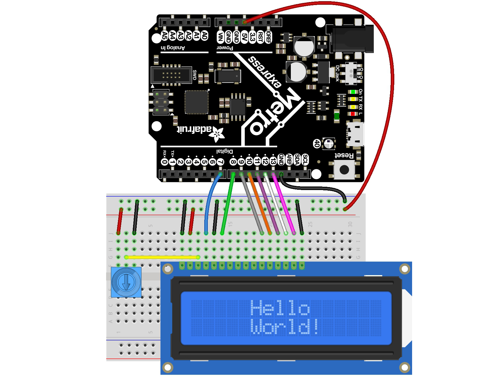
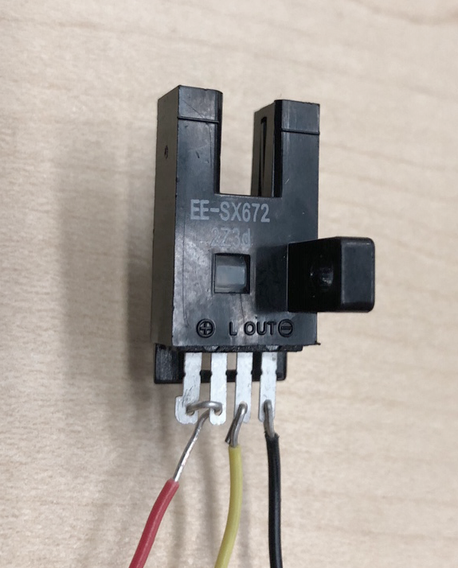
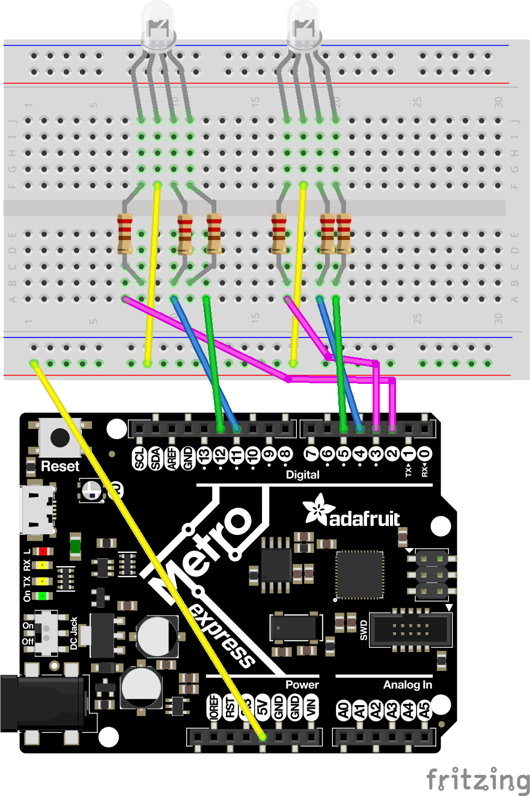

# CircuitPython

My CircuitPython Assignments

## CircuitPython: Blink
### Objective
Objective of this assignment was to 
### Picturess

### Lessons

## CircuitPython: Servo touch
### Objective
### Pictures

### Lessons

## CircuitPython: LCD
### Objective
### Pictures

### Lessons

## CircuitPython: Photointerrupters
### Objective
### Pictures

### Lessons

## CircuitPython: Distance Sensor
### Objective
### Pictures

### Lessons

## RGB
### Objective
### Pictures

### Lessons

## Hello VS Code
### Objective
### Pictures

### Lessons

## FancyLED
### Objective
### Pictures

### Lessons

